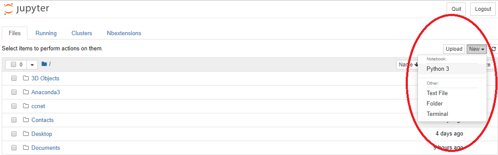
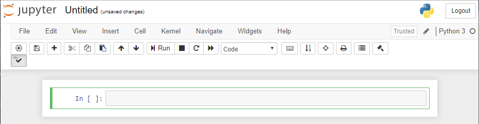
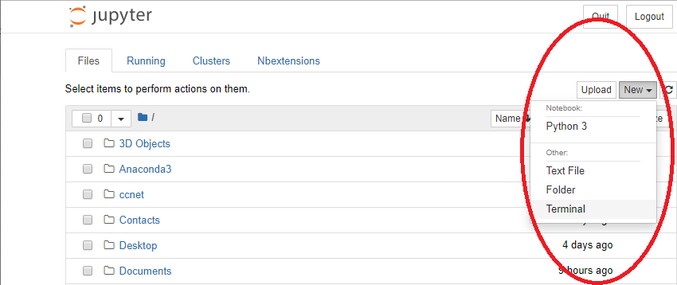
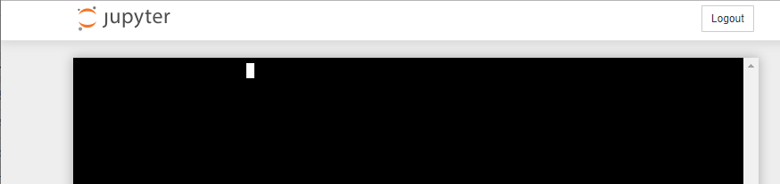
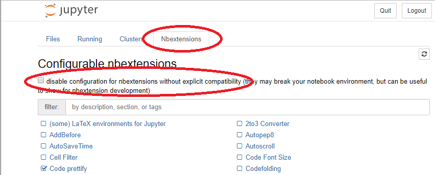

---
redirect_from:
  - "/01/installingjupyter"
interact_link: content/E:\Git\DataDrivenMethods\TestBook\content\01/InstallingJupyter.ipynb
kernel_name: python3
has_widgets: false
title: 'Install'
prev_page:
  url: /01/IntroductionMotivation.html
  title: 'IntroMot'
next_page:
  url: /02/Test.html
  title: 'Section Bla'
comment: "***PROGRAMMATICALLY GENERATED, DO NOT EDIT. SEE ORIGINAL FILES IN /content***"
---


# Installing Python and Jupyter Notebook

The first thing you will need to do to participate in this course is to install Python on your personal PC. You need approximately 3GB free space on your hard drive. Without Python, you will not be able to participate since we want to enforce active learning in this course and this means that you need to be able to code in Python!

While it is generally up to you which Python distribution you want to install, we strongly recommend to use Anaconda. It is the most widely used Python distribution, easy to install and it includes Jupyter Notebook, which you will need for your project work.

**Installation and getting started**

1. Go to [https://www.anaconda.com/distribution/](https://www.anaconda.com/distribution/) and download Python version 3.7 for the operating system that you are using (Windows, Mac and Linux are supported).

1. After installation, open Anaconda Navigator. You should see a window similar to this one:

    

1. On the Anaconda Navigator opening screen, click on "Launch" Jupyter Notebook. A new tab will be opened in your standard internet browser:

    

1. To open your first Jupyter Notebook, click on "New" on the right of the Jupyter Notebook Home screen and then on "Python 3". A new tab will be opened in which you can start coding in Python!

    

You may also use other Python editors but the beauty of Jupyter Notebooks is that it has a very clean appearance which makes it easy for you to focus on the most important things (programming) and you can easily add text (in Markdown language) in between your code to describe and document what you are doing. This will help learning and revisiting problems during the course and communicating your results to us or your peers and friends. Therefore, we strongly recommend to use Jupyter Notebooks for coding.

For a more exhaustive introduction and explanation of Jupyter Notebook, please refer to the official documentation at:

[https://jupyter-notebook.readthedocs.io/en/stable/examples/Notebook/Notebook%20Basics.html](https://jupyter-notebook.readthedocs.io/en/stable/examples/Notebook/Notebook%20Basics.html)

*Congratulations, you (and your PC) are now ready for the course!*


# Optional: Advanced Jupyter Notebook Features

To further enhance your programming experience, you may install Jupyter Notebook extensions as follows.

**Note: Installing Jupyter Notebook extensions is not necessary for the course! We recommend to skip this for now and try it later when you became more familiar with Jupyter Notebook.**

1. From the Jupyter Notebook Home screen, click on "New" and then on "Terminal":

    
    
1. A new terminal will be opened, which will look similar to this:

    

1. Copy/type the following command into the terminal
    ```
    pip install jupyter_contrib_nbextensions; jupyter contrib nbextension install --user
    ```
    and hit enter.
    
1. When installation is completed, close all Jupyter tabs in your browser and quit Anaconda. Then restart Anaconda and Jupyter Notebooks. 

1. Now you should be able to see "Nbextensions" on your Jupyter Home screen. Click on it and make sure to uncheck the box saying "disable configuration for nbextensions without explicit compatibility".

    

1. You may now enable or disable several extensions for Jupyter Notebook. For example, you may check "spellchecker" for enabling automatic spell checking or "Toggle all line numbers" for enabling a button to show the line numbers in your code. There are several other useful extensions which you might be interested in. For a full explanation for what each extension is doing, go to

    [https://jupyter-contrib-nbextensions.readthedocs.io/en/latest/nbextensions.html](https://jupyter-contrib-nbextensions.readthedocs.io/en/latest/nbextensions.html) 

