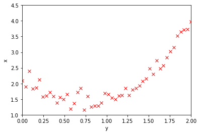

---
redirect_from:
  - "/02/test"
interact_link: content/E:\Git\DataDrivenMethods\TestBook\content\02/Test.ipynb
kernel_name: python3
has_widgets: false
title: 'Section Bla'
prev_page:
  url: /01/Intro.html
  title: 'Intro'
next_page:
  url: 
  title: ''
comment: "***PROGRAMMATICALLY GENERATED, DO NOT EDIT. SEE ORIGINAL FILES IN /content***"
---


# Motivation and Basic Concepts

Hello, here's some text.

And at least a little formula

$\frac{1}{2}=\exp{x^2}$


<div markdown="1" class="cell code_cell">
<div class="input_area" markdown="1">
```python
import numpy as np
import matplotlib.pyplot as plt

np.random.seed(5)

x=np.linspace(0,2,50)
b0=1
b1=0.5
beta=np.array([b0,b1])
sigma2=0.2

def fun(x,beta):
    return beta[0]*(2-x)+beta[1]*x**3

data=fun(x,beta)+sigma2*np.random.normal(0,1,x.size)

plt.figure(1)
plt.plot(x, data, 'rx')
plt.axis([0, 2, 1, 4.5])
plt.xlabel('y')
plt.ylabel('x')


X=np.array([2-x,x**3])
Xt=np.transpose(X)
y=data

```
</div>

<div class="output_wrapper" markdown="1">
<div class="output_subarea" markdown="1">

{:.output_png}


</div>
</div>
</div>

